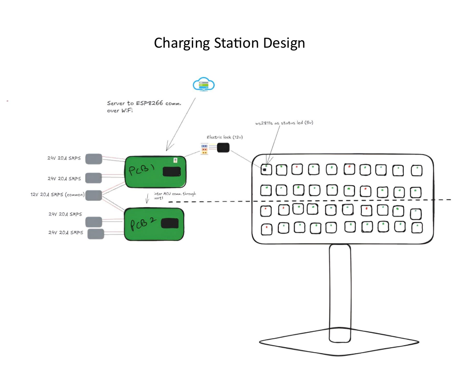
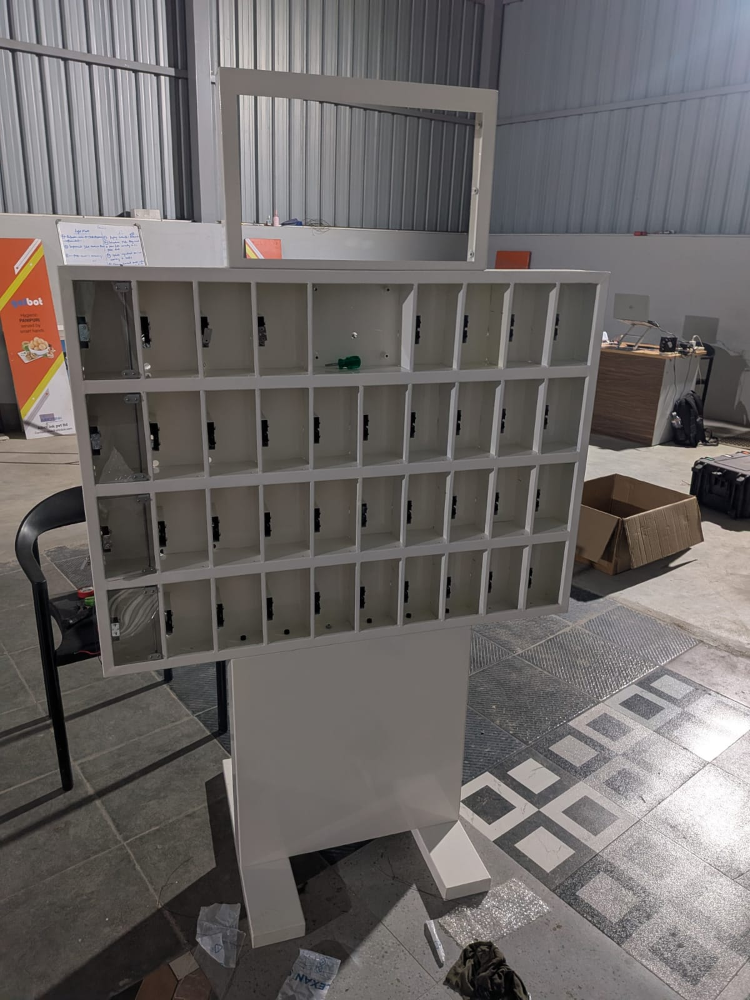
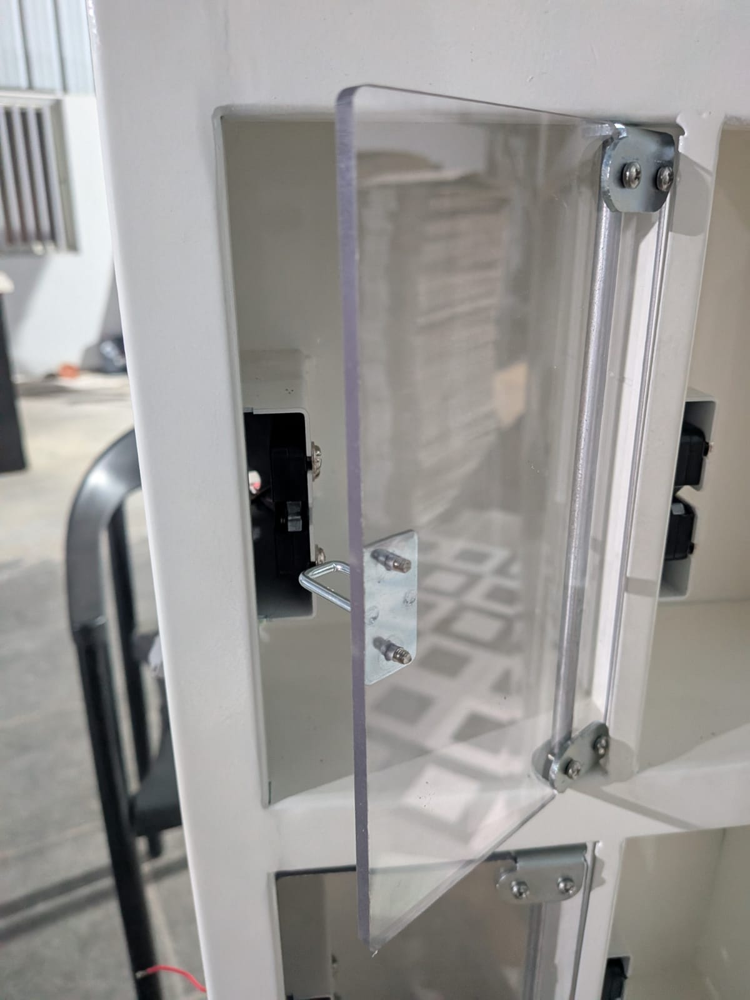

# 📱 Smart Charging Station

A smart, secure mobile phone charging station featuring locker-based compartments, an interactive HMI interface, and time-based charging control.

---

## 🚀 Overview

This project implements a **mobile charging station** with multiple secure locker-like chambers. Users interact with a touchscreen interface (HMI) to select a locker, charge their device, and securely store it during the charging session.

The system provides **30 minutes of free charging**, after which users can authenticate and retrieve their device.

---

## 🧩 Key Features

- 🔒 **Secure Locker System**
  - Multiple independent charging compartments
  - Lock/unlock mechanism for each locker

- 🖥️ **HMI (Human Machine Interface)**
  - Touch-based interface for user interaction
  - Displays available lockers
  - Handles user input and system feedback

- 🔌 **Built-in Charging**
  - Charging cable inside each locker
  - Supports standard mobile devices

- ⏱️ **Timed Charging**
  - 30 minutes of free charging
  - Session tracking and timeout handling

- 📲 **User Authentication**
  - Phone number input for locker retrieval
  - Ensures secure access to devices

## Product Images

<!-- Top Image -->

<!-- Bottom Images in a row -->
<table>
  <tr>
    <td>
      
    </td>
    <td>
      
    </td>
  </tr>
</table>

